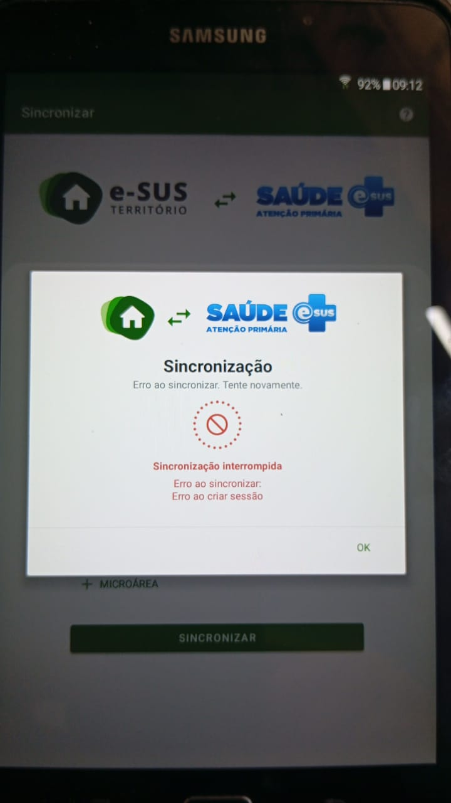

# Esus Certificado Tablet Android

# 📚 Tutorial de Instalação do Certificado ISRG Root X1 em Tablets Android

Este tutorial mostra como resolver o erro de certificado SSL ao acessar um sistema web (como o e-SUS APS) em tablets Android. O problema ocorre quando o dispositivo não reconhece o certificado da autoridade certificadora Let's Encrypt, usada em servidores HTTPS.

## 🔧 Requisitos

- Certificado raiz da Let's Encrypt: ISRG Root X1
- Tablet com Android (versões mais antigas podem apresentar esse erro)
- Acesso ao armazenamento do dispositivo

## 📥 Etapa 1 – Download do Certificado

1. Acesse o link oficial:
   [https://letsencrypt.org/certs/isrgrootx1.pem](https://letsencrypt.org/certs/isrgrootx1.pem)

2. Salve o arquivo e renomeie para:

isrg-root-x1.crt

👉 [Clique aqui para abrir o certificado](./isrg-root-x1.crt)   

3. Transfira o arquivo para o tablet usando cabo USB, e-mail ou outro meio.

## 📲 Etapa 2 – Instalação no Android

1. No tablet, vá em:
**Configurações > Segurança > Instalar do armazenamento**  
*(Pode variar: “Criptografia e credenciais” ou “Credenciais do usuário”)*

2. Localize o arquivo `isrg-root-x1.crt` no armazenamento interno.

3. Quando solicitado, escolha o uso como:
**"CA"** ou **"VPN e aplicativos"**

4. Dê um nome ao certificado, como:

ISRG Root X1

5. Confirme a instalação.

> O sistema pode solicitar um bloqueio de tela para permitir a instalação de certificados confiáveis.

## ✅ Etapa 3 – Teste

1. Abra o navegador do tablet ou o aplicativo e-SUS Território.

2. Acesse o domínio do sistema, por exemplo:

https://esus.seudominio.sp.gov.br

Aplicativo: e-SUS Território

https://play.google.com/store/apps/details?id=br.gov.saude.acs&pcampaignid=web_share

3. O site ou aplicativo deve carregar sem erro de “certificado inválido”.

## ℹ️ Observações

- A validade do certificado Let's Encrypt geralmente é de 90 dias.  
- Tablets com Android antigo podem não ter suporte à nova cadeia de certificados da Let's Encrypt, por isso a instalação manual é necessária.  
- A instalação do certificado como **usuário** é suficiente para resolver o problema em navegadores e aplicativos que respeitam essa configuração.

## 🔔 Aviso no tablet após instalação do certificado

Após a instalação do certificado raiz ISRG Root X1 no tablet, pode aparecer uma mensagem informando que:

> “O dispositivo pode estar sendo monitorado”  
> ou  
> “As redes podem ser monitoradas devido à instalação de um certificado de segurança”

Essa mensagem é **normal e esperada** em aparelhos Android sempre que um certificado de autoridade confiável é instalado manualmente pelo usuário.

### O que isso significa?

- O aviso é apenas uma **medida de precaução do sistema Android**.
- Ele indica que, **tecnicamente**, o tablet agora confia em um novo certificado.
- Isso **não quer dizer que o tablet está sendo monitorado ou hackeado**.
- O funcionamento do dispositivo continua normal e seguro.

Esse aviso permanece enquanto o certificado estiver instalado, mas **não afeta o uso de aplicativos, navegação ou segurança real do sistema**.

